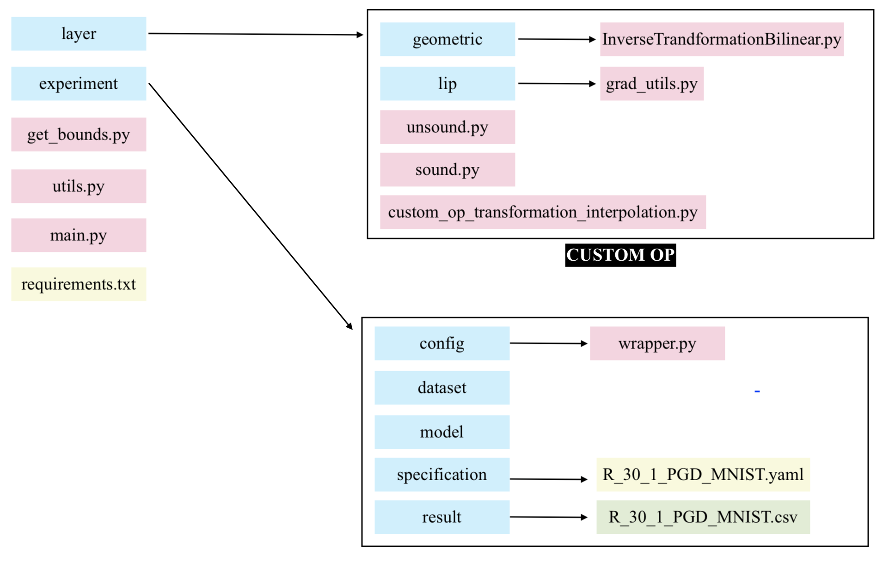

# SuperDeepG

Safety‑critical applications require models to behave as expected under *geometric* perturbations such as **rotation, scaling, shearing, and translation**.  
**SuperDeepG** verifies neural‑network robustness to these perturbations by **combining linear‑relaxation (CROWN‑type) bounds with Lipschitz optimisation**.  
The approach keeps the certificates *tight* while remaining **GPU‑friendly**.  
Extensive experiments show state‑of‑the‑art certified accuracy and runtime.

---

## Installation

> **Prerequisite:** Python ≥ 3.11

```bash
# 1. Install the verification backend (before cloning this repository)
git clone https://github.com/Verified-Intelligence/auto_LiRPA
cd auto_LiRPA
pip install .

# 2. Install SuperDeepG and its direct dependencies
cd ..
git clone https://github.com/gitanonyme/SuperDEEPG.git
pip install -r requirements.txt
```

---
## Datasets and models

*Datasets*: The MNIST and CIFAR10 datasets will be automatically downloaded into the `dataset/` folder. The TinyImageNet dataset need to be manually downloaded.
- TinyImageNet: Use [this script](https://github.com/Verified-Intelligence/auto_LiRPA/blob/master/examples/vision/data/tinyImageNet/tinyimagenet_download.sh) to obtain the dataset.

*Models*: Pretrained models for MNIST and CIFAR10 are provided in `experiment/model/`.

- CGT TinyImageNet: Weights must be downloaded manually from [Google Drive](https://drive.google.com/drive/folders/1NB6MUgzphUW_YetLJAQAu7EatwnroB28?usp=sharing) and placed into `experiment/model/`. (Note: The only change from the original is the deletion of the first normalization layer.)
- VNNCOMP'24 TinyImageNet: The ONNX file must be downloaded manually from [GitHub](https://github.com/huanzhang12/vnncomp2024_tinyimagenet_benchmark/blob/main/onnx/TinyImageNet_resnet_medium.onnx) and placed into `experiment/model/TINY_new/cnn7/`.

---

## Quick start

### Verify a network

```bash
python main_batch.py --config_path experiment/specification/example.yaml
```

> Results are written to `experiment/results/`.

### Analyse the results

```bash
python analyze.py experiment/results/example_results.csv
```

---

## Codebase overview

| Path / file                         | Purpose                                                                        |
|------------------------------------|--------------------------------------------------------------------------------|
| `main_batch.py`                       | Main script to verify networks                      |
| `layer/`                            | Contains algorithms for geometric transformations                                  |
| `experiment/`                       | Contains dataset, network and perturbation specification for each experiment                                         |
| `experiment/specification/*.yaml`  | YAML configurations that steer an experiment                                   |



---


## YAML configuration 

### `dataset`

| Key                    | Type        | Description                                                                 |
|------------------------|-------------|-----------------------------------------------------------------------------|
| `path`                 | `str`       | Root directory of the dataset. Example: `experiment/dataset/MNIST_Dataset` |
| `path_process` `process_dataset_func` | `str`   | Path and name of the function to load the dataset         |
| `num_images`           | `int`       | Number of images to verify                                                 |

### `model`

| Key               | Type        | Description                                                             |
|-------------------|-------------|-------------------------------------------------------------------------|
| `weights_path`    | `str`       | Path to the trained model weights                                       |
|  `path` `weight_loader`  | `str`      | Path and name of the function to load the model weights into the architecture           |


### `solver`

| Key                       | Type     | Description                                                                 |
|---------------------------|----------|-----------------------------------------------------------------------------|
| `config`                  | `list`   | Transformation type and bounds. Example: `["rotate", -30, 30, 1]`          |
| `theta_batch_size`        | `int`    | Batch size of transformation parameters per solver pass                   |
| `methods`                 | `list`   | List of bound propagation methods. E.g., `["CROWN"]`                        |
| `KKT_samples`             | `int`    | **Step 1**: Number of samples              |
| `KKT_samples_batch`       | `int`    | Batch size for step 1 sampling (avoids OOM during sampling loop)           |
| `split_second_step`       | `int`    | **Step 2**: Number of partitions       |
| `split_second_step_batch` | `int`    | Batch size for processing sub-regions in step 2                            |
| `display_info`            | `bool`   | If true, prints verification information   (optional, default: False)          |

> **Note**:  
> `KKT_samples_batch` and `split_second_step_batch` both help control GPU memory use by batching tensor computations.

> **Note**:  
> We converted the PGD TensorFlow models to .pt format to ensure consistency with the CGT models. They are available in `experiments/model`.

For guidance on implementing the custom operators required for replication, we refer readers to the official [**auto-LiRPA tutorial**](https://github.com/Verified-Intelligence/auto_LiRPA/blob/cf0169ce6bfb4fddd82cfff5c259c162a23ad03c/examples/vision/custom_op.py#L16).
